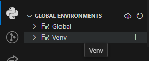
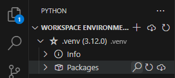

# crimes-delits

- [crimes-delits](#crimes-delits)
  - [installation (développeur)](#installation-développeur)
    - [git](#git)
    - [vsc extensions](#vsc-extensions)
    - [environnement virtuel](#environnement-virtuel)
      - [création](#création)
      - [installation de packages](#installation-de-packages)
      - [distribution](#distribution)
  - [utilisation de git sous vsc](#utilisation-de-git-sous-vsc)
    - [fetch](#fetch)
    - [pull](#pull)
    - [checkout](#checkout)
    - [commit](#commit)
    - [pull request](#pull-request)

## installation (développeur)

### git

Pour travailler sur ce projet il vous faudra [git](https://git-scm.com/downloads), un système de contrôle de version.  
Il vous sera demander par la suite de vous identifiez alors autant le faire maintenant. Via votre terminal de choix veuillez indiquer votre adresse électronique et votre nom.

```commande
git config --global user.name "Your Name Comes Here"
git config --global user.email you@yourdomain.example.com
```

Une fois git téléchargé, sous Visual Studio Code il est possible de cloner le répertoire via le bouton de Source Control.  


### vsc extensions

Une fois le répertoire cloné un prompt vous recommendera d'installer certaines extensions, procédez à l'installation.
Si vous n'avez pas déjà [Visual Studio Code](https://code.visualstudio.com/download) c'est le moment de le télécharger.

### environnement virtuel

Afin de faciliter la gestion des packages installés on utilisera l'extension Python Environment Manager:  



Il vous faudra créer la première fois un environnement virtuel [Python 3.12](https://www.python.org/downloads/).  
Si vous ne possédez pas cette version veuillez cocher "Add Python 3.12 to PATH" avant de procéder à l'installation standard de python via l'exécutable (ce procéssus peut différer selon l'OS).

#### création

- Pour procéder à la création de l'environnement virtuel il vous suffit d'appuyer sur le plus (+) à coté de Venv (situé dans l'onglet Global Environments, sous l'activité Python). Cela créera un dossier .venv au niveau du répertoire local.
VSC vous proposera de changer d'environnement pour choisir celui tout juste créé, acceptez.  

#### installation de packages

- Pour installer des packages il vous suffit d'appuyer sur la loupe à côté de Package sur votre environnement virtuel situé dans l'onglet Workspace Environnement.  

  

#### distribution

- Pour exporter l'environnement il suffit d'appuyer sur la flèche au niveau de votre environnement virtuel. Cela créera un fichier, veuillez le nommer requirements.txt.  

  

- Ce fichier doit être tenu à jour pour faciliter la distribution du répertoire. Lors de la création d'un environnement virtuel via l'extension Python Environnement Manager disponible sur le Marketplace le fichier requirements.txt sera lu.  
Si ce fichier est mis à jour par un collaborateur et que vous voulez vous épargner la tâche de recréer un environnement virtuel il vous est possible d'installer les packages via la commande suivante:

``` comamnde
pip install -r requirements.txt
```

- Cette commande est à lancer depuis votre terminal de choix avec votre environnement virtuel actif. Vous pouvez y accéder depuis l'extension Python Environment Manager via "|>|" (Sur windows, powershell peut poser problème, veuillez choisir un autre terminal via Ctrl+Shift+P, >Terminal: Select Default Profile, Command Prompt est recommandé).


## utilisation de git sous vsc

vous trouverez tous les outils de source control via le panneau d'activité sur la gauche. Il est impératif d'être à jour sur votre répertoire local avant d'y apporter des modifications.

  

### fetch

git fetch met à jour toutes les références distantes sur votre dépôt local sans modifier vos références locales.

### pull

git pull fait la même chose que la commande git fetch, mais en plus, elle vas merge votre branche courante avec sa référence distante.

### checkout

git checkout bascule sur une autre branche ou restaure des fichiers de l’arbre de travail. Il vous ait demander de travailler sur une branche indépendante de main lors de ce projet afin déviter les conflits, permettre la révision de code et éviter l'abondance de commit sur la branche main. Veuillez appeller votre branche "dev-PNNN", PNNN étant votre quadrigramme (exemple: Loïc LEGUILLE -> LLEG).

### commit

git commit permet d'enregistrer les modifications dans le dépôt.
il est important d'avoir des messages clair et concis sur les changements effectués.

### pull request

Une fois votre développement terminé sur votre branche il est important de faire une requête de pull sur GitHub afin de mettre à jour la branche main pour les autres développeurs.
